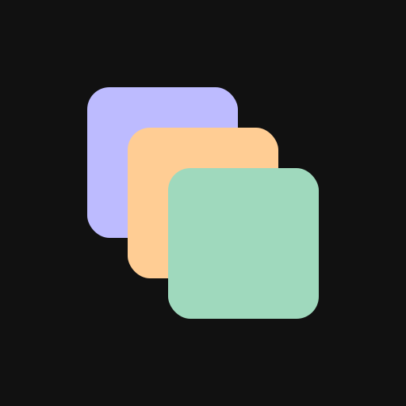

<p align="center">
  
</p>

<h1 align="center">pastel-vue</h1>

<p align="center">
  <a href="https://github.com/nvms/pastel-vue/actions/workflows/ci.yml"></a>
  <a href="https://www.npmjs.com/package/pastel-vue"></a>
</p>

pastel-vue is a Vue 3 component library with a soft, pastel-toned aesthetic. It covers the pieces an application UI actually needs: forms and inputs, overlays, navigation, data display, and a set of components aimed at AI and LLM tooling such as token views, cost estimators, diff viewers, and evaluation scorecards.

The full component showcase, with live variants for every component, is published at **[nvms.github.io/pastel-vue](https://nvms.github.io/pastel-vue/)**.

## Install

```
npm install pastel-vue vue
```

`vue` (3.4 or newer) is a peer dependency.

## Quick start

Import the stylesheet once, near your app entry, then use components anywhere.

```js
// main.js
import { createApp } from "vue"
import App from "./App.vue"
import "pastel-vue/style.css"

createApp(App).mount("#app")
```

```vue
<script setup>
import { ref } from "vue"
import { Button, Input, Field, Card } from "pastel-vue"

const email = ref("")
</script>

<template>
  <Card>
    <Field label="Work email" hint="We never share it.">
      <Input v-model="email" type="email" placeholder="you@company.com" />
    </Field>
    <Button variant="primary" :disabled="!email">Continue</Button>
  </Card>
</template>
```

## Examples

### A save button that shows progress

The `Button` animates its width as it swaps in a spinner, so the layout never jumps while a request is in flight.

```vue
<script setup>
import { ref } from "vue"
import { Button } from "pastel-vue"

const saving = ref(false)

async function save() {
  saving.value = true
  try {
    await fetch("/api/profile", { method: "PUT" })
  } finally {
    saving.value = false
  }
}
</script>

<template>
  <Button variant="primary" :loading="saving" loading-label="Saving" @click="save">
    Save changes
  </Button>
</template>
```

### Toasts without a provider

Mount `Notifications` once at the root of your app. Anywhere else, call `toast` and friends directly.

```vue
<!-- App.vue -->
<script setup>
import { Notifications } from "pastel-vue"
</script>

<template>
  <RouterView />
  <Notifications />
</template>
```

```js
import { toast } from "pastel-vue"

toast.success("Profile saved")
toast.error("Upload failed", {
  description: "The file was larger than 25 MB.",
  action: { label: "Retry", onClick: retryUpload },
})
```

### Estimating the cost of an LLM call

`CostEstimator`, `TokenView`, and the `tokenize` / `costOf` helpers turn a prompt into a token count and a dollar figure before you send it.

```vue
<script setup>
import { ref, computed } from "vue"
import { TokenView, tokenize, costOf, formatUSD } from "pastel-vue"

const prompt = ref("Summarize the attached contract in three bullet points.")
const tokenCount = computed(() => tokenize(prompt.value).count)
const cost = computed(() => costOf("gpt-5", tokenCount.value, 0))
</script>

<template>
  <TokenView :text="prompt" />
  <p>{{ tokenCount }} tokens, about {{ formatUSD(cost?.total) }} per call</p>
</template>
```

## What's included

Roughly 90 components, grouped the way the showcase is:

- **Primitives** - Button, Badge, Card, Panel, Stat, Callout, Banner, Avatar, Spinner, Skeleton, ProgressBar, and more
- **Forms** - Input, Textarea, Select, Checkbox, Switch, RadioGroup, Field, Combobox, TagInput, PinInput
- **Controls** - NumberInput, Scrubber, ToggleGroup, Rating, Knob
- **Overlays** - Tooltip, Popover, Modal, Drawer, DropdownMenu, ContextMenu, Notifications
- **Data** - Slider, DatePicker, DateRangePicker, MultiSelect, Pagination, Tree, Accordion, Table, Breadcrumbs
- **Data viz and insight** - Timeline, Sparkline, Gauge, ActivityHeatmap, DiffViewer, CodeBlock, DistributionBar, ConfidenceMeter, EmbeddingMap
- **LLM tooling** - TokenView, Conversation, CostBreakdown, CostEstimator, ChunkedDocument, RetrievedChunks, CitedAnswer
- **Evaluation** - EvalSuite, EvalScorecard, EvalComparison, EvalRubricScore, EvalAssertion
- **Layout and navigation** - Tabs, AppLayout, ListDetail, SideNav, PageHeader, Toolbar, MenuBar, Wizard, SegmentedControl

Browse them all, with editable props, in the [showcase](https://nvms.github.io/pastel-vue/).

## Local development

The showcase runs on [Histoire](https://histoire.dev).

```
npm install
npm run dev      # start the showcase dev server
npm run build    # build the static showcase site
npm run preview  # preview the built site
```

## Status

This project is an experiment in AI-maintained open source - autonomously built, tested, and refined by AI with human oversight.

## License

MIT
